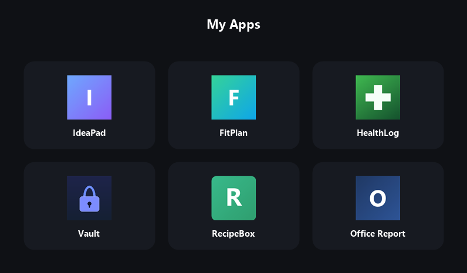

# Apps

Public HTTPS hosting (via GitHub Pages) for a set of installable web apps, so they
can be added to a phone's home screen and installed as standalone apps:

- **Finance Manager** — `/financemanager/` — budgeting with real UK take-home pay (2025/26 tax & NI).
- **IdeaPad** — `/ideapad/` — cross-device idea notepad.
- **FitPlan** — `/fitplan/` — cross-device gym planner.
- **MyFitCoach** — `/fitcoach/` — PureGym technique coach: illustrated machine movements, dual front/back muscle-group maps, a tap-a-muscle explorer, and a session builder with a combined muscle map.
- **HealthLog** — `/healthlog/` — personal health tracker (glucose, meds, measurements).
- **Vault** — `/vault/` — encrypted password manager.
- **RecipeBox** — `/recipebox/` — diabetic-friendly cookbook with carbs-forward nutrition, allergen/diet filters, and a daily plate tracker.
- **Office Report** — `/officereport/` — office-staff disciplinary log & management reports.
- **Shopfloor Report** — `/shopfloorreport/` — shopfloor disciplinary log & reports (Operators / Lines / Team Leaders).
- **Mastic Calc** — `/masticcalc/` — sealant coverage & tubes-to-order calculator: doorset perimeter, bead size, tube volume, waste, and materials cost (total + per-doorset).
- **Quality Report** — `/qualityreport/` — shopfloor quality faults log & reports: faults by department, date, door number and operative, an Awareness → Termination escalation ladder, and per-operative, per-department and monthly management reports.
- **Seal Coverage** — `/sealcoverage/` — fire-door intumescent seal estimator: leaf sizes, edge counts and doors on the job converted to metres and rolls/lengths to order across each seal type (25×2, 20×2, Flood, 15×2, Flipper), with waste added.

Each app is a self-contained `index.html` plus a web app manifest, a service
worker (offline app shell), and icons. The apps store data locally and sync
across devices via a private GitHub gist; **no secrets are stored in these files**
(the sync token lives only in each device's browser).

The source of truth for each app lives in its own repo; the copies here are the
hosted, installable versions.

## Install on a phone (Chrome / Android)

1. Open the app's URL (e.g. `https://<user>.github.io/apps/ideapad/`).
2. Menu (⋮) → **Install app** (or **Add to Home screen**).
3. Launch it from the home-screen icon — it opens standalone and works offline.

On iOS use Safari → Share → **Add to Home Screen**.

## Maintaining these apps — service-worker cache convention

Each app's `sw.js` has a cache name of the form `<app>-v<N>` (e.g. `healthlog-v7`).
On activation the service worker **deletes every cache except its own current
`<app>-v<N>`**, so bumping that number is what forces installed devices to pick up
a new version. To avoid collisions when more than one person/session edits this
repo, follow these rules:

1. **One namespace per app.** Only ever bump the cache for the app whose files you
   changed. Never do a blanket "bump every app's cache" in a single commit — that
   collides with other apps' independent version counters and desyncs them.
2. **Read before you bump.** Check the current value in `apps/<app>/sw.js` and
   increment from *that* (`grep CACHE apps/<app>/sw.js`). Don't assume the next
   number from an app's own `APP_VERSION` string — the SW cache counter and the
   in-app version label are independent and will not match.
3. **Bump only when the app's shell files change** (`index.html`, `manifest`,
   icons, or `sw.js` itself). A pure cross-link/text tweak in *another* app is not
   a reason to touch this app's cache.
4. **Monotonic, never reused.** Cache numbers only go up. If unsure of the highest
   ever used for an app, check `git log -- apps/<app>/sw.js`.

Current cache versions (keep this list roughly in step when you bump one):
`financemanager-v12` · `fitplan-v13` · `fitcoach-v18` · `ideapad-v4` · `healthlog-v7` · `vault-v8` · `recipebox-v25` · `officereport-v11` · `shopfloorreport-v3` · `masticcalc-v5` · `qualityreport-v1` · `sealcoverage-v2`.
